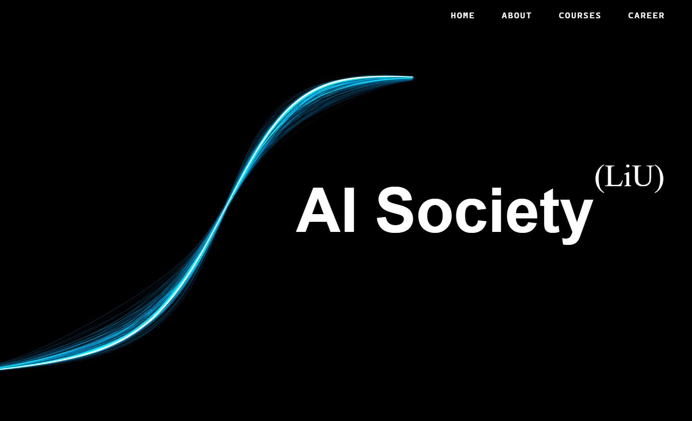

# LiU AI Society — Website



The official website for [LiU AI Society](https://liuais.com), the student association for artificial intelligence at Linköping University. Built with Next.js, Three.js, and Sanity.

---

## Stack

| Layer | Technology |
|---|---|
| Framework | Next.js 16 (App Router) |
| 3D / Animation | Three.js + GSAP |
| CMS | Sanity v5 |
| Email | Resend |
| Newsletter | Kit (ConvertKit) |
| Styling | Plain CSS (globals.css) |
| Language | TypeScript |

---

## Pages

| Route | Description |
|---|---|
| `/` | Home — animated sigmoid arc hero, events, vision, partner section, newsletter signup |
| `/about` | Board members and founders |
| `/events` | Upcoming and past events with suggest-event modal |
| `/projects` | AI & ML projects with tech stack filtering and community submission |
| `/courses` | AI & ML courses at LiU |
| `/career` | Job listings — manual postings via CMS + auto-fetched from LiU RSS |
| `/logo` | Isolated logo view (arc + wordmark) |
| `/studio` | Sanity Studio (CMS) |

---

## Getting started

**1. Install dependencies**
```bash
npm install
```

**2. Set up environment variables**

Create a `.env.local` file in the project root:

```env
# Sanity
NEXT_PUBLIC_SANITY_PROJECT_ID=your_project_id
NEXT_PUBLIC_SANITY_DATASET=production

# Kit (ConvertKit) — newsletter signups
KIT_API_KEY=your_kit_api_key
KIT_FORM_ID=your_kit_form_id

# Resend — transactional email (event suggestions, partner enquiries, project submissions)
RESEND_API_KEY=your_resend_api_key
```

**3. Run the dev server**
```bash
npm run dev
```

Open [http://localhost:3000](http://localhost:3000).

---

## CMS — Sanity

Content is managed through Sanity Studio at `/studio`. To set up:

1. Create a project at [sanity.io](https://sanity.io)
2. Add your project ID and dataset to `.env.local`
3. Deploy the studio or use it locally at `/studio`

### Document types

**Event** — title, date, location, image, tags, Luma URL, gallery, leaderboard, speaker, testimonials, and more.

**Project** — title, description, cover image, GitHub URL, tech stack tags, contributors (with GitHub usernames for avatars), and status (active / completed / archived).

**Job Posting** — title, company, location, deadline, description, apply URL, tag (Full-time / Internship / Thesis / PhD / etc.), and accent color. Postings are automatically hidden after their deadline passes.

---

## Email setup

Contact forms send email via [Resend](https://resend.com):

- **Suggest an event** (`/api/suggest-event`) — from the Events page
- **Partner enquiry** (`/api/partner`) — from the home page partner section
- **Submit a project** (`/api/suggest-project`) — from the Projects page

---

## Newsletter

Member signups and membership checks go through the [Kit](https://kit.com) API (`/api/newsletter`). The form collects name, email, LiU ID, program, and graduation year.

---

## Contact

[contact@liuais.com](mailto:contact@liuais.com)
